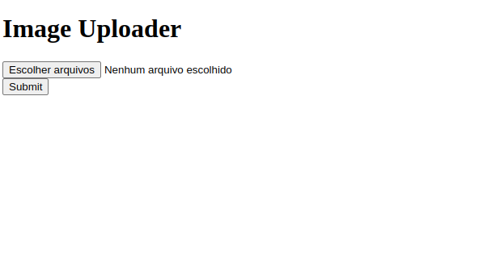

# Simple Multiple Images Uploader

> # Description 

This reusable component allows users to upload images, preview them before confirmation, and easily remove unwanted files. It simplifies the integration of image uploads into your web application and enhances the user experience during image selection.

## 🛠️ Technologies 

- React
- Vite
- Git and Github

